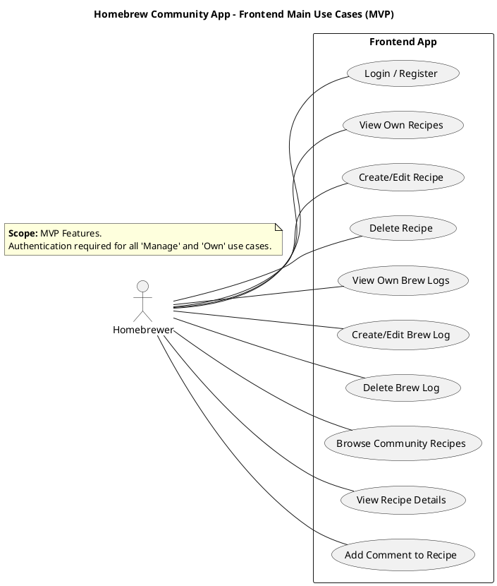
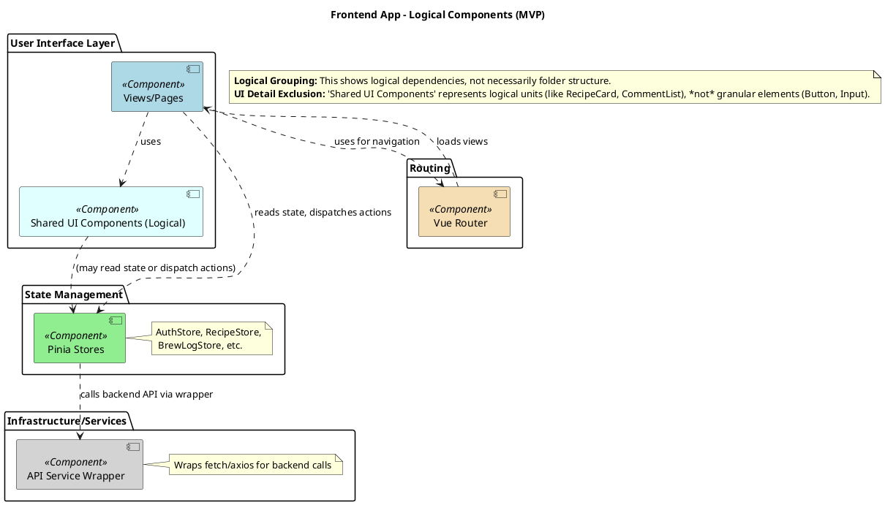
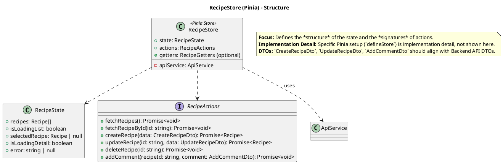
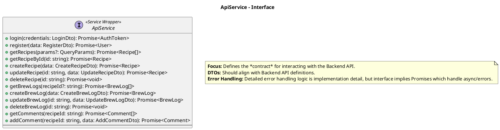
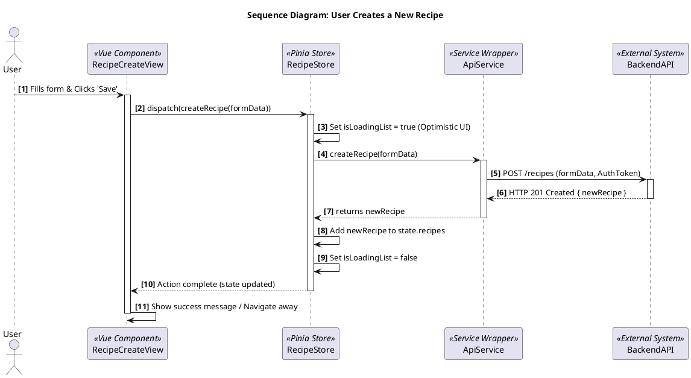

# “自酿啤酒社群”APP - 前端 UML 样例 (AI UML 架构师输出)

**版本:** 1.0
**日期:** 2025-03-26
**目标读者:** 下游 AI 工具 (代码生成器等), 前端开发者 (作为高级蓝图)
**核心原则:** AI 优先, 文本 UML (PlantUML), 分层细化, MECE, 聚焦核心结构与行为, **明确排除 UI 细节**。

---

## Level 1: 应用上下文层 (Frontend App Context)

**目标:** 定义前端应用与外部世界的交互边界。

### `level_1_context/main_use_cases.puml`



### `level_1_context/context_diagram_c4.puml`

```plantuml
@startuml
!include https://raw.githubusercontent.com/plantuml-stdlib/C4-PlantUML/master/C4_Container.puml

LAYOUT_WITH_LEGEND()

Person(user, "Homebrewer", "User accessing the app via browser or mobile device.")
System_Boundary(app_boundary, "Homebrew Community App") {
    Container(frontendApp, "Frontend Application", "Vue 3 / Vite / Pinia", "Provides the user interface, manages local state, interacts with the backend.")
}
System_Ext(backendApi, "Backend API", "Provides data, business logic, and authentication via HTTPS/JSON.")

Rel(user, frontendApp, "Uses", "HTTPS")
Rel(frontendApp, backendApi, "Makes API Calls", "HTTPS/JSON")

@enduml
```

### `level_1_context/annotations_l1.md`

*   **Focus:** Defines *what* the user can do via the frontend and *which systems* the frontend interacts with externally.
*   **Boundary:** The internal workings of the "Backend API" are out of scope for the frontend context.

---

## Level 2: 关键视图/模块层 (Frontend App Components/Modules)

**目标:** 划分前端应用内部的主要逻辑区域及其依赖关系。

### `level_2_components/component_diagram.puml`



### `level_2_components/annotations_l2.md`

*   **Architecture:** Standard Single Page Application (SPA) structure with clear separation of concerns (UI, State, Services).
*   **Key Dependencies:** Views depend on State and Router. State depends on API Services.

---

## Level 3: 内部细节层 (View/Component/State/Service Internals)

**目标:** 详细描述 L2 中关键模块的内部结构和核心交互逻辑。

### 组件: `State Management (Pinia)`

#### `level_3_details/state/recipe_store_class.puml`



### 组件: `Services`

#### `level_3_details/services/api_service_class.puml`



### 关键用户流程: `Create Recipe`

#### `level_3_details/sequences/sequence_create_recipe.puml`



#### `level_3_details/annotations_l3_frontend.md` (汇总或分散到具体图注释)

*   **State Management:** Pinia is used for centralized state. Stores encapsulate state logic and API interactions.
*   **API Interaction:** All backend communication goes through the `ApiService` wrapper.
*   **User Flow Focus:** Sequence diagrams illustrate key user interactions driving state changes and API calls.
*   **Structure Focus:** Class diagrams define interfaces and data structures (State, DTOs, Service methods), not visual components.
*   **Boundary Explicit:** Detailed UI layout, CSS, specific form validation rules (beyond data types), and complex animations are explicitly **out of scope** for this UML specification. They should be handled during implementation, potentially guided by UI mockups and real-time AI code assistance.

---

## 输出包结构 (示例)

```
/design_spec_homebrew_frontend_v1.0
    README.md
    /level_1_context
        main_use_cases.puml
        context_diagram_c4.puml
        annotations_l1.md
    /level_2_components
        component_diagram.puml
        annotations_l2.md
    /level_3_details
        /state
            recipe_store_class.puml
            auth_store_class.puml # (Similar structure)
            brew_log_store_class.puml # (Similar structure)
        /services
            api_service_class.puml
        /sequences
            sequence_create_recipe.puml
            sequence_login.puml # (Similar detail level)
            sequence_view_recipe_detail.puml # (Shows fetching data)
        annotations_l3_frontend.md # (Or notes within puml files)
```


