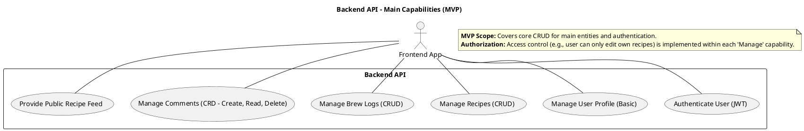
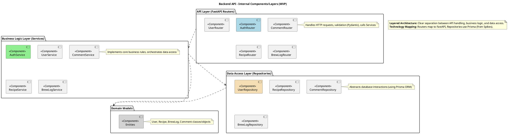
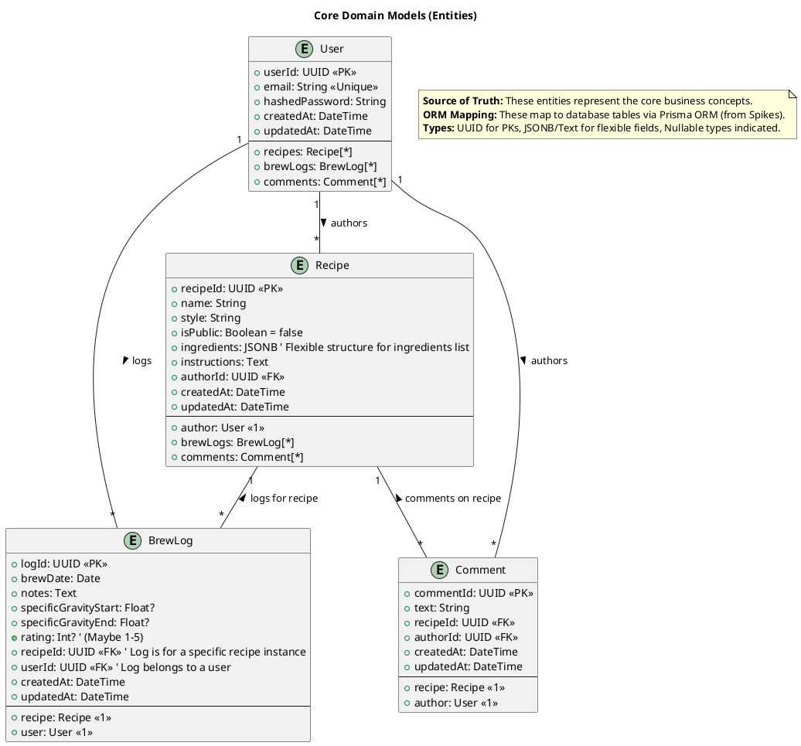
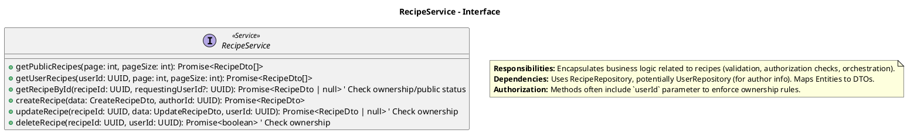
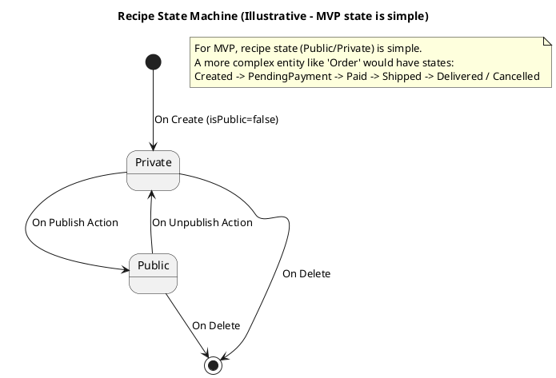

# “自酿啤酒社群”APP - 后端 UML 样例 (AI UML 架构师输出)

**版本:** 1.0
**日期:** 2025-03-26
**目标读者:** 下游 AI 工具 (代码生成器, API 文档生成器等), 后端开发者 (作为核心蓝图)
**核心原则:** AI 优先, 文本 UML (PlantUML), 分层细化, MECE, 聚焦核心结构与行为, **明确排除基础设施和底层细节**。

---

## Level 1: 系统上下文层 (Backend API Context)

**目标:** 定义后端 API 与外部世界的交互边界和主要依赖。

### `level_1_context/context_diagram_c4.puml`

```plantuml
@startuml
!include https://raw.githubusercontent.com/plantuml-stdlib/C4-PlantUML/master/C4_Container.puml

LAYOUT_WITH_LEGEND()

title Homebrew Community App - Backend API Context

System_Ext(frontendApp, "Frontend Application", "Consumes the API via HTTPS/JSON.")
' Potentially other consumers like Mobile App or Admin Tool in the future
' System_Ext(mobileApp, "Mobile App", "...")

System_Boundary(backend_boundary, "Homebrew Community Backend") {
    Container(backendApi, "Backend API", "FastAPI / Python", "Handles business logic, data access, auth for the Homebrew Community App.")
}

SystemDb_Ext(database, "Database", "PostgreSQL", "Stores user data, recipes, logs, comments.")
' Potentially other external systems like an Email Service or a future Payment Gateway
' System_Ext(emailService, "Email Service", "Used for notifications (future).")

Rel(frontendApp, backendApi, "Makes API Calls", "HTTPS/JSON")
Rel(backendApi, database, "Reads/Writes data", "SQL/TCP (via ORM)")
' Rel(backendApi, emailService, "Sends Emails", "HTTPS/API") ' Example for future extension

@enduml
```

### `level_1_context/main_api_capabilities.puml` (可以用 Use Case 图或简单列表)



### `level_1_context/annotations_l1.md`

*   **Focus:** Defines *who* consumes the API and *what external systems* the API depends on. Outlines the main functional areas provided.
*   **Boundary:** Internal implementation details are hidden. Frontend interaction details are out of scope for the backend context.

---

## Level 2: 关键模块/服务层 (Backend API Components/Modules)

**目标:** 划分后端 API 内部的主要逻辑分区及其依赖关系。

### `level_2_components/component_diagram.puml`



### `level_2_components/annotations_l2.md`

*   **Architecture:** Layered architecture chosen for maintainability and testability.
*   **Key Dependencies:** API depends on Services, Services depend on Repositories and Domain Models. Direct access from API to Repositories is generally avoided.

---

## Level 3: 内部细节层 (Module/Service Internals)

**目标:** 详细描述 L2 中关键模块/服务的内部结构和核心交互逻辑。

### 领域模型: `Domain Models`

#### `level_3_details/domain/classes_core_models.puml` (已在前端部分展示过，这里可能更详细)



### 业务逻辑层: `Services`

#### `level_3_details/services/recipe_service_interface.puml` (展示接口/主要方法签名)



### 关键 API 流程: `Create Recipe`

#### `level_3_details/sequences/sequence_api_create_recipe.puml` (与前端序列图的后端部分对应并细化)

```plantuml
@startuml
title Sequence Diagram: POST /recipes - Create Recipe

participant "RecipeRouter" as Router <<FastAPI Router>>
participant "RecipeService" as Service <<Service>>
participant "RecipeRepository" as Repo <<Repository>>
database "Database" as DB <<PostgreSQL>>

autonumber "<b>[B0]" ' B for Backend

Router -> Router: Validate Request Body (Pydantic DTO: CreateRecipeDto)
alt Validation Fails
  Router --> Client: HTTP 422 Unprocessable Entity
else Validation Success
  Router -> Router: Get authenticated userId from JWT
  Router -> Service: createRecipe(validatedData, userId)
  activate Service
    ' Business logic/validation within Service (e.g., check name uniqueness?)
    Service -> Repo: save(recipeEntity) ' recipeEntity created from DTO + authorId
    activate Repo
      Repo -> DB: INSERT INTO "Recipes" (...) VALUES (...)
      activate DB
      DB --> Repo: Success (returns saved record)
      deactivate DB
      Repo --> Service: Saved Recipe Entity
    deactivate Repo
    Service -> Service: Map Entity to RecipeDto
    Service --> Router: RecipeDto
  deactivate Service
  Router --> Client: HTTP 201 Created { recipeDto }
end

@enduml
```

### 核心实体状态: `Recipe` (如果状态复杂)

#### `level_3_details/state_machines/recipe_state.puml` (此例中 Recipe 状态简单，可能不需要)



### `level_3_details/annotations_l3_backend.md` (汇总或分散)

*   **Domain Model:** Core entities defined, reflecting business concepts.
*   **DTOs:** Separate objects for API contract, validated by framework.
*   **Layering:** Clear separation of Router (API), Service (Logic), Repository (Data).
*   **Data Access:** Prisma ORM used via Repository pattern (based on Spikes).
*   **Authentication:** JWT based, userId extracted for authorization checks in Service layer.
*   **Boundary:** Excludes detailed SQL, infra config, complex algorithm internals. Error handling shown conceptually in sequences.

---

## 输出包结构 (示例)

```
/design_spec_homebrew_backend_v1.0
    README.md
    /level_1_context
        context_diagram_c4.puml
        main_api_capabilities.puml
        annotations_l1.md
    /level_2_components
        component_diagram.puml
        annotations_l2.md
    /level_3_details
        /domain
            classes_core_models.puml
        /dtos
            recipe_dtos.puml
            auth_dtos.puml
            # ... other DTOs
        /services
            recipe_service_interface.puml
            auth_service_interface.puml
            # ... other service interfaces
        /repositories # (Interfaces mainly, implementation implied by ORM choice)
            recipe_repository_interface.puml
            user_repository_interface.puml
            # ... other repository interfaces
        /sequences
            sequence_api_create_recipe.puml
            sequence_api_user_login.puml
            # ... other key API flows
        /state_machines # (If applicable)
            # recipe_state.puml (If needed)
        annotations_l3_backend.md
```

